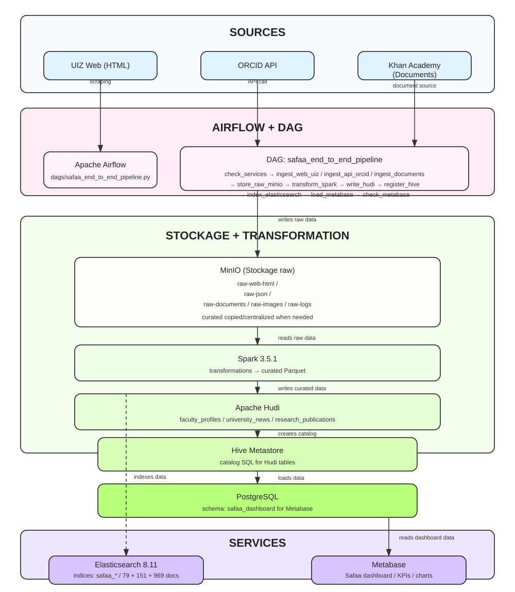

# University Data Platform 


> **Plateforme d’ingestion & d’analyse de données académiques** pour les universités marocaines.
>
> Données : **UM5 (Web)**, **Toubkal / IMIST (PDF)**, **Crossref API** → normalisation → stockage data lake + analytics (Spark/Hudi/Parquet, Hive/Metastore, PostgreSQL, Elasticsearch) + visualisation **Metabase**.

---

## 1) Présentation générale 

**University Data Platform** est une plateforme data **end-to-end** conçue pour automatiser :

- **L’ingestion** de données depuis des sources académiques hétérogènes :
  - **UM5 Web** (scraping HTML) : news & profils de faculty
  - **Toubkal IMIST** (scraping PDF) : thèses (documents)
  - **Crossref API** : publications académiques
- **La transformation** et la structuration :
  - via **Apache Spark**
  - avec une couche **curated** (Hudi/Parquet)
  - et un **catalog SQL** via **Hive Metastore**
- **L’indexation pour la recherche** :
  - via **Elasticsearch**
- **La restitution BI** :
  - via **Metabase** (dashboard de **7 KPIs**)
- **L’orchestration** :
  - via **Apache Airflow** (pipeline planifié)

---

## 2) Architecture (description + diagramme textuel) 




### Flux fonctionnel (high-level)

1. **Ingestion** 
   - Scrapers (Python) récupèrent les données.
   - Les scrapers écrivent des **fichiers bruts** et des **JSON structurés** dans **MinIO**.
2. **Transformation** 
   - Spark lit depuis MinIO (`s3a://...`).
   - Écrit les données en **curated** (Hudi/Parquet) et crée des tables **Hive**.
3. **Indexation** 
   - Spark (ou jobs associés) prépare un format ES.
   - Indexation dans Elasticsearch dans l’index `university_data`.
4. **BI & Recherche** 
   - Metabase lit les tables structurées et affiche les **7 KPIs**.
   - Elasticsearch permet recherche / exploration via documents indexés.

---

## 3) Stack technologique 

- **Langage / runtime** : Python
- **Orchestration** : **Apache Airflow**
- **Ingestion** : scrapers Python
- **Stockage Data Lake** : **MinIO (S3 compatible)**
- **Transformation** : **Apache Spark 3.5.1**
- **Curated format** : **Hudi / Parquet** (avec Spark + Hive)
- **Catalog SQL** : **Hive Metastore** (DB Postgres)
- **Données structurées** : **PostgreSQL**
- **Recherche** : **Elasticsearch 8.11**
- **BI** : **Metabase**
- **Conteneurisation** : **Docker Compose**

---

## 4) Structure du projet 

```text
src/
  ingestion/
    web/         # Scrapers UM5 (HTML)
      um5.py
    docs/        # Scraper Toubkal / IMIST (PDF)
      toubkal.py
    api/         # Scraper Crossref (API)
      crossref.py

  processing/   # Spark transformation + Elasticsearch indexation
    spark_transform.py
    transform_script.py
    index_to_elasticsearch.py
    es_indexer_simple.py

  storage/minio/
    sara_client.py   # Client MinIO (upload, buckets)

dags/
  sara_pipeline.py    # DAG Airflow : ingestion → transformation → indexation

docker-compose.yml
requirements.txt
README.md
RUNBOOK.md  
```

---

## 5) Installation & démarrage (Docker Compose)

### Pré-requis
- Docker Desktop (ou Docker Engine)
- Docker Compose

### Lancer l’infrastructure
```bash
docker compose up -d
```

### Vérification rapide
- Vérifier les conteneurs :
```bash
docker ps
```

---

## 6) Sources de données & volumes 

### Sources externes
1. **UM5 Web** (HTML)
   - news (actualités)
   - profils faculty (enseignants)
   - extraction images et contenus associés quand disponibles
2. **Toubkal IMIST** (PDF)
   - exploration de pages d’items
   - téléchargement des PDF depuis les routes “/full”
3. **Crossref API**
   - publications académiques via pagination `offset/rows`

### MinIO buckets (data lake) 

Buckets attendus/centralisés pour le pipeline :
- `raw-json` - Données structurées JSON
- `raw-documents` - PDFs et documents
- `raw-web-html` - Pages HTML brutes
- `raw-images` - Images extraites
- `raw-logs` - Logs d'ingestion
- `curated` - ✅ Données transformées (Parquet)

> Les scrapers écrivent des données **brutes** et **structurées JSON** dans MinIO.
> Les jobs Spark lisent depuis la zone et écrivent dans `curated`.

### Organisation (partitionnement)
- Objets organisés par date : `year=YYYY/month=MM/day=DD` (selon la logique d’ingestion)
- Données structurées en JSON
- Binaires en objets (HTML / images / PDF)

---

## 7) Commandes d’exécution (scrapers, transformation, indexation) 

> Les scrapers et traitements sont implémentés comme modules Python.
> Les scripts de transformation/indexation sont déclenchés par Airflow via `BashOperator`.

### 7.1 Scrapers (ingestion)

#### 1) Crossref (publications)
```bash
python -m src.ingestion.api.crossref
```

#### 2) IMIST / Toubkal (PDF thèses)
```bash
python -m src.ingestion.docs.toubkal
```

#### 3) Scraper UM5 (faculty + news + médias)
```bash
python -m src.ingestion.web.um5
```

---

### 7.2 Transformation Spark (curated + Hive)

#### Script orchestrateur
```bash
python -m src.processing.spark_transform
```

#### Script Spark (exécuté via spark-submit)
- `src/processing/transform_script.py`

> La transformation lit depuis MinIO puis écrit :
> - `s3a://curated/faculty_profiles`
> - `s3a://curated/university_news`
> et crée/refresh des tables Hive :
> - `faculty_profiles`
> - `university_news`

---

### 7.3 Indexation Elasticsearch

#### Script orchestrateur
```bash
python -m src.processing.index_to_elasticsearch
```

#### Script indexeur (exécuté via spark-submit)
- `src/processing/es_indexer_simple.py`

> Index cible : `university_data`
> - `faculty` : doc contient nom, institution, département, suggest
> - `news` : doc contient title, institution, category, suggest

---

## 8) Accès aux services (ports & endpoints) 

| Service | URL | Port |
|---|---:|---:|
| **MinIO Console** | http://localhost:9001 | 9001 |
| **MinIO S3** | http://localhost:9000 | 9000 |
| **Metabase** | http://localhost:3000 | 3000 |
| **Airflow Webserver** | http://localhost:8081 | 8081 |
| **Elasticsearch** | http://localhost:9200 | 9200 |
| **Spark Master UI** | http://localhost:8090 | 8090 |

### Identifiants (selon `docker-compose.yml`)
- **MinIO** : `minioadmin` / `minioadmin`
- **Airflow** : `admin` / `admin`
- **Metabase** : À configurer au premier lancement (création compte admin)
- **PostgreSQL** : `hive` / `hive` (port 5435)

---

## 9) Résultats des données 

Statistiques issues de l’exécution actuelle du pipeline :

- **faculty_profiles** : **468** professeurs 
- **university_news** : **115** actualités 
- **university_theses** : structure préparée (pipeline Toubkal/PDF)
- **Elasticsearch** : index `university_data` contient **583** documents indexés

✅ **Le DAG Airflow `sara_university_pipeline` s'exécute avec succès, toutes les tâches passent en vert.**
Le pipeline est conçu pour être reproductible : en cas d'échec, les tâches peuvent être relancées individuellement via l'UI Airflow.

### KPIs Metabase (8) 

Ces KPIs permettent de visualiser en temps réel l'état des données ingérées et transformées.

1. **Total Professors**
2. **Total News**
3. **Total Departements**
4. **Professors by Institution**
5. **News by Institution**
6. **Top 10 Departments**
7. **News by Category**
8. **Recent News**

---

## 10) Pistes d'amélioration / Roadmap 

- [ ] **Finaliser l’intégration Hudi**
  - activer une stratégie de mise à jour/incrémentale plus robuste
  - valider le partitionnement par institution/date
- [ ] **Enrichissement Crossref**
  - normaliser davantage les champs (auteurs, DOI, type, année)
  - relier les publications aux institutions si mapping possible
- [ ] **Thèses (Toubkal/IMIST) : completude**
  - améliorer la détection des métadonnées
  - pipeline complet d’indexation & visualisation (si souhaité)
- [ ] **Recherche Elasticsearch : mappings & analyzers**
  - définir mappings plus stricts (type/suggest/autocomplete)
  - ajouter scoring et filtres (institution, category, type)
- [ ] **Observabilité**
  - logs ingestion → `raw-logs`
  - métriques Airflow/Spark pour suivi qualité
- [ ] **Production-ready**
  - gestion des secrets (au lieu des valeurs en dur)
  - exécutions idempotentes et stratégie de ré-essais renforcée

---

## 11) Preuves de test 

Toutes les captures d'écran des tests sont disponibles dans le dossier `docs/screenshots/`.

- [ ] UI Airflow - Vue d'ensemble du DAG (toutes les tâches en vert)
- [ ] UI Airflow - Logs d'une tâche
- [ ] UI Airflow - Graph View
- [ ] MinIO - Liste des buckets
- [ ] MinIO - Contenu d'un bucket (raw-json)
- [ ] Elasticsearch - Nombre de documents indexés
- [ ] Elasticsearch - Résultat de recherche
- [ ] Metabase - Dashboard (8 KPIs)
- [ ] Docker - Tous les conteneurs en cours

✅ Toutes les captures ont été prises et sont disponibles dans le dossier.

---

## Notes de fonctionnement 

- Le DAG Airflow **`sara_university_pipeline`** exécute (chaîne) :
  1) `scrape_um5`
  2) `scrape_toubkal`
  3) `scrape_crossref`
  4) `transform_spark`
  5) `index_elasticsearch`
- Les scripts Spark utilisent un endpoint MinIO S3 compatible :
  - `spark.hadoop.fs.s3a.endpoint=http://minio:9000`

---

### Checklist rapide 
- Vérifier Elasticsearch : `curl -X GET "http://localhost:9200/university_data/_count" | python -m json.tool`
- Démarrer : `docker compose up -d`
- Ouvrir Airflow : http://localhost:8081
- Déclencher le DAG `sara_university_pipeline`
- Vérifier MinIO (buckets) puis Metabase (KPIs) et Elasticsearch (index)


---
## 📚 Documentation complémentaire

- [Runbook d'exploitation](RUNBOOK.md) - Guide opérationnel
- [Architecture détaillée](docs/archi.svg) - Schéma complet
- [Demo Script](docs/demo-script.md) - Script de présentation pour la soutenance

---

## 12) Auteurs

- Projet réalisé dans le cadre du challenge University Data Platform.
