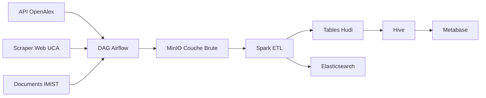

# University Data Platform — MVP

## 1. Présentation du Projet

**Objectif** — Construire une plateforme de données automatisée qui ingère, stocke, transforme et expose les données universitaires de multiples sources pour l'analyse et la recherche.

**Pipeline** — Sources → MinIO (lac brut) → Spark ETL → Hudi (tables curationnées) → Hive / Elasticsearch → Metabase

**Stack**

| Composant     | Rôle                             |
|---------------|----------------------------------|
| MinIO         | Lac de données compatible S3     |
| Spark         | Transformation distribuée        |
| Hudi          | Format de table ACID sur S3      |
| Hive Metastore| Couche SQL sur les tables Hudi   |
| Metabase      | Tableaux de bord métier          |
| Elasticsearch | Moteur de recherche full-text    |
| Airflow       | Orchestration du pipeline        |

---

## 2. Sources de Données et Ingestion

Trois types de sources sont ingérés dans MinIO (bucket `raw-json`) :

| Source  | Type   | Outil                         | Volume        |
|---------|--------|-------------------------------|---------------|
| OpenAlex | API    | `requests` + pagination       | ~180 auteurs  |
| UCA / ENSA Marrakech | Web scraping statique | BFS crawl + `BeautifulSoup` | ~1 100 pages, 280 enseignants, 170 cours |
| IMIST   | Extraction PDF | `PyMuPDF` + analyseur de mots-clés | 25 documents |

Les JSON bruts atterrissent dans `s3a://raw-json/source=<nom>/` avec métadonnées d'exécution et `crawl_timestamp`.

---

## 3. Pipeline de Transformation

Un seul job Spark (`run_all_etl.py`) exécute 5 ETL séquentiellement :

1. **faculty_profiles** — éclatement de tableaux imbriqués, normalisation, dédoublonnage → 180 enregistrements
2. **course_catalog** — même motif → 56 enregistrements
3. **university_news** — 15 enregistrements
4. **research_publications** — 20 enregistrements
5. **documents_registry** — 25 enregistrements

Chaque ETL lit du JSON depuis MinIO, applique des transformations (mappage de colonnes, hash SHA2 pour dédoublonnage), écrit une table **Hudi COPY_ON_WRITE** dans `s3a://hudi-curated/`, puis écrit le DataFrame dédoublonné dans Elasticsearch.

Qualité des données : rejet des JSON corrompus (nouvelle tentative avec `multiLine`), suppression des enregistrements nuls, application du schéma via le mappage des noms de colonnes.

---

## 4. Couche SQL Hive

Les tables Hudi sont enregistrées dans Hive Metastore via `hoodie.datasource.hive_sync`. Chaque table est partitionnée par `source_system` et interrogeable en SQL standard depuis n'importe quel client compatible Hive.

---

## 5. Tableau de Bord Metabase

Metabase se connecte à Hive via le pilote JDBC Thrift. Le tableau de bord affiche :

- Nombre d'enseignants · Nombre de cours · Actualités · Publications
- Répartition par système source
- Statistiques du registre de documents
- Chronologies des dates de publication

Tous les KPI sont rafraîchis à partir des tables Hudi curationnées à chaque chargement de page.

---

## 6. Système de Recherche Elasticsearch

Elasticsearch 8.11 indexe les mêmes 5 jeux de données pour une recherche full-text à faible latence :

| Index                   | Documents |
|-------------------------|-----------|
| `faculty_profiles`      | 180       |
| `course_catalog`        | 56        |
| `university_news`       | 15        |
| `research_publications` | 20        |
| `documents_registry`    | 25        |

Chaque document possède un `record_id` utilisé comme `_id` Elasticsearch pour des mises à jour idempotentes. Les mappings d'index sont définis par index (formats de date, champs text avec sous-champs `keyword`).

---

## 7. Orchestration Airflow

### Pourquoi Airflow

Avant Airflow, chaque étape était manuelle — exécuter un script Python, attendre, en exécuter un autre, déboguer les erreurs en faisant défiler le terminal. Airflow fournit :

- **Planification** — cadence `@daily`, aucune exécution manquée
- **Nouvelles tentatives automatiques** — 3 tentatives avec intervalle de 2 minutes
- **Journaux centralisés** — toutes les sorties des tâches au même endroit
- **Gestion des dépendances** — les tâches s'exécutent uniquement quand l'amont réussit
- **Délai d'exécution** — arrêt des tâches bloquées après 30 minutes
- **Intégration Docker** — les tâches contrôlent les conteneurs Docker depuis Airflow

### DAG : `chaimae_pipeline`



**Tâches**

| ID de Tâche | Fonction Python | Rôle |
|-------------|----------------|------|
| `openalex_to_minio` | `run_openalex()` | Parcourt l'API OpenAlex pour les institutions marocaines, écrit le JSON dans `raw-json/source=openalex/` |
| `uca_to_minio` | `crawl_uca()` | Parcours BFS des sites UCA / ENSA, extrait les profils enseignants + catalogue de cours, écrit le JSON. Timeout BFS de 2 minutes auto-imposé pour éviter les exécutions infinies. |
| `imist_pdfs_to_minio` | `download_toubkal_pdfs()` | Extrait le texte d'environ 25 PDF avec découpage par mots-clés, écrit dans `raw-json/source=imist/` |
| `spark_etl_to_elasticsearch` | `run_etl_pipeline()` | `docker exec` dans `spark-master` → `spark-submit run_all_etl.py`. Le spark-submit se connecte à MinIO, exécute les 5 ETL, écrit les tables Hudi et indexe dans Elasticsearch. |

**Flux de dépendances**

```
                 ┌─────────────────────┐
                 │ openalex_to_minio   │
                 └──────────┬──────────┘
                            │
                 ┌──────────▼──────────┐
                 │    uca_to_minio     │
                 └──────────┬──────────┘
                            │
                 ┌──────────▼────────────┐
                 │ imist_pdfs_to_minio   │
                 └──────────┬────────────┘
                            │
                 ┌──────────▼──────────────────────┐
                 │ spark_etl_to_elasticsearch      │
                 └─────────────────────────────────┘
```

L'exécution est séquentielle à cause du `SequentialExecutor`, donc la durée totale est la somme de toutes les tâches (~6 min de scraping + 4 min d'ETL = ~10 min).

### Comment Démontrer

**Exécution propre :**
```bash
docker exec airflow-webserver airflow dags trigger chaimae_pipeline
```

**Suivi :**
```bash
docker exec airflow-webserver airflow tasks states-for-dag-run \
    chaimae_pipeline manual__$(date -u +%Y-%m-%dT%H:%M:%S)+00:00
```

**Vérification ES :**
```bash
curl localhost:9200/faculty_profiles/_count
```

**Interface Airflow :**
`http://localhost:8080`

**Interface Metabase :**
`http://localhost:3000`

### Correctifs Appliqués

1. **Timeout BFS** — `max_duration=120s` arrête le crawleur web après 2 minutes (parcourait 1 100 pages indéfiniment)
2. **Dédoublonnage avant écriture ES** — `.dropDuplicates(["record_id"])` dans l'ETL empêche les documents en double
3. **Format du crawl_timestamp** — expression régulière étendue pour accepter 3 à 6 chiffres de fraction de seconde
4. **Partitions de shuffle** — réduites de 800 à 4 (mode local, petites données)
5. **Cache DataFrames** — `df.cache()` après lecture MinIO élimine les lectures S3 redondantes
6. **Évolution de schéma** — la configuration Hudi autorise les changements de type de champ lors des ré-exécutions
7. **Capture d'erreurs** — Docker `exec_run(stderr=True)` expose les erreurs Spark dans les journaux des tâches
8. **Socket Docker** — les conteneurs Airflow montent `/var/run/docker.sock` pour contrôler Docker depuis les tâches

---

## 8. Guide de Présentation (centré Airflow)

### Structure (10–15 min)

#### 1. Introduction (1 min)

Montrez le schéma d'architecture global.

```
Sources → Airflow → MinIO → Spark ETL → Hudi → Hive / ES → Metabase
```

**Phrase clé :** *"Tout part d'Airflow. Une seule plateforme orchestre l'ingestion, la transformation et l'indexation de A à Z."*

#### 2. Live : L'interface Airflow (2 min)

Ouvrez `http://localhost:8080`

Montrez :
- La liste des DAGs → cliquez sur `chaimae_pipeline`
- La vue **Graph** → les 4 tâches et leurs dépendances
- La vue **Code** → le code Python du DAG (défilez rapidement)
- La vue **Tree View** → l'historique des exécutions

**Phrase clé :** *"Airflow me donne une visibilité totale : état, durée et logs de chaque tâche."*

#### 3. Les 3 sources d'ingestion (3 min)

Pour chaque tâche, cliquez → **Log** et montrez la sortie :

| Tâche | À montrer dans les logs |
|-------|------------------------|
| `openalex_to_minio` | *"Fetching page 1... Fetching page 2..."* — preuve de la pagination API |
| `uca_to_minio` | Les URLs visitées par le BFS crawl. Insistez sur le **timeout 2 min** ajouté (*"sans ça, la tâche tournait indéfiniment sur 1100 pages"*) |
| `imist_pdfs_to_minio` | Les noms des PDFs extraits |

**Phrase clé :** *"Trois sources différentes — API, Web, PDF — unifiées par Airflow dans un seul lac MinIO."*

#### 4. La transformation Spark (2 min)

Tâche `spark_etl_to_elasticsearch` → **Log** → montrez la fin :

```
faculty_profiles    OK    180 records
course_catalog      OK     56 records
university_news     OK     15 records
research_publications OK  20 records
documents_registry  OK     25 records
```

Say : *"Airflow lance spark-submit dans le conteneur spark-master via Docker. Spark lit MinIO, transforme, écrit Hudi et indexe ES. Le job mettait >20 min, maintenant ~4 min (cache, shuffle partitions, mémoire)."*

#### 5. Résultat : Metabase + ES (2 min)

**Metabase** `http://localhost:3000` — montrez le dashboard :
- Compteurs (enseignants, cours, actus, publications)
- Graphiques de répartition par source

**Elasticsearch** — une requête rapide :
```bash
curl http://localhost:9200/faculty_profiles/_search?q=physique
```

**Phrase clé :** *"Du scraping à la visualisation, sans intervention manuelle."*

#### 6. Démo live (si possible, 3 min)

1. Airflow → **Trigger DAG**
2. Montrez les tâches qui s'exécutent en direct
3. Ouvrez Metabase à côté pour montrer que les données précédentes sont visibles
4. Revenez à Airflow pour la fin des tâches

### Préparation Q&R

| Question | Réponse |
|----------|---------|
| *Pourquoi Hudi ?* | ACID sur S3, upsert, snapshot isolation, Hive Sync intégré. |
| *Pourquoi pas tout dans Spark ?* | Hudi donne des tables persistantes queryables en SQL. Spark seul ne stocke pas. |
| *Problème le plus difficile ?* | Le schéma Hudi incompatible entre exécutions. Résolu avec `schema.allow.key.field.schema.changes=true`. |
| *Scalabilité ?* | DAG : SequentialExecutor → CeleryExecutor pour parallélisme. Spark : local[*] → cluster. |
| *Pourquoi ES + Hive ?* | Hive = analytique SQL lent. ES = recherche full-text <100ms. |

### Slides à préparer

1. Schéma architectural (flèche horizontale)
2. Capture d'écran Airflow — Graph View
3. Logs de chaque tâche (preuve de succès)
4. Dashboard Metabase (capture des KPIs)
5. Résultat d'une requête Elasticsearch
